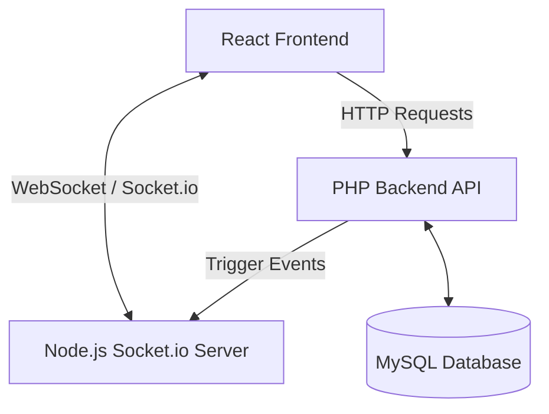

# WebSocket Integration Strategy (Socket.io)

This document outlines the architecture for integrating real-time features into the AI Prompt Marketplace using **Socket.io**. 

Since the primary backend is written in **PHP** (which is request-driven and not inherently designed for long-lived WebSocket connections), we need a separate **Node.js service** to handle the Socket.io connections.

## 1. System Architecture



### Communication Flow:
1. **Frontend to PHP**: The React frontend sends standard HTTP POST/PUT requests to the PHP backend to insert/update prompt posts or submit reports.
2. **PHP Database Action**: The PHP backend updates the MySQL database.
3. **PHP to Node.js Notification**: After a successful database operation, the PHP backend notifies the Node.js Socket.io server that an event occurred. This is typically done via an internal HTTP POST request (e.g., using `curl`) or via Redis Pub/Sub.
4. **Node.js to Frontend**: The Node.js server broadcasts the event via Socket.io to the relevant connected frontend clients.

## 2. Event Structure

We need to support real-time updates for:
- **Prompt Posts**: Insert, Update, Select (fetching real-time updates for a specific prompt or feed).
- **Reports**: Notifications when a new report is filed or status is updated.

### Defined Socket Events

| Event Name | Payload | Emitted To | Purpose |
|------------|---------|------------|---------|
| `prompt_inserted` | `{ promptId, title, authorId, ... }` | `feed_room` / Global | Notify users that a new prompt was posted |
| `prompt_updated` | `{ promptId, updatedFields }` | `prompt_{id}_room` | Update users currently viewing this specific prompt |
| `prompt_deleted` | `{ promptId }` | `prompt_{id}_room` | Notify viewing users that the prompt is removed |
| `report_notification` | `{ reportId, targetId, reason }` | `admin_room` / Creator | Notify admins/creators of a new report |

## 3. Component Setup

### 3.1 Node.js Socket.io Server (New Microservice)
- Initialize a simple Express + Socket.io app.
- Provide a private HTTP endpoint (e.g., `POST /internal/emit`) that only accepts requests from localhost (the PHP server).
- When the endpoint receives a payload like `{ event: "prompt_updated", room: "prompt_123", data: {...} }`, it calls `io.to(room).emit(event, data)`.

### 3.2 PHP Backend Updates
- Whenever `insert`, `update`, or `delete` operations happen on Prompts or Reports, trigger a helper function (e.g., `emit_socket_event()`).
- This helper makes a rapid non-blocking HTTP call to the Node.js server.

### 3.3 React Frontend Updates
- Install `socket.io-client`.
- Create a context (`SocketContext`) or a custom hook (`useSocket`) to maintain a single connection to the Node.js server.
- Connect to specific rooms when navigating. For example, when entering `PromptDetail.jsx`, emit `join_room` with `prompt_{id}`. When leaving, emit `leave_room`.
- Listen for events like `prompt_updated` to dynamically refresh the UI or invalidate React Query/local state caches.

## 4. Handling Multiple Devices per User

To ensure that a user who is logged in on multiple devices (e.g., their phone and their laptop) receives notifications simultaneously across all active sessions, we utilize Socket.io's built-in **Rooms** feature.

### Implementation Strategy
1. **Connection Payload**: When the React frontend establishes a Socket.io connection, it passes the current `userId` (retrieved from `sessionStorage` or local state) in the authentication payload or initial handshake.
2. **Auto-Joining User Rooms**: On the Node.js server, as soon as a socket connects and the `userId` is verified, the server forces that socket to join a specific room named after the user.
   ```javascript
   // Node.js server
   io.on("connection", (socket) => {
       const userId = socket.handshake.auth.userId;
       if (userId) {
           socket.join(`user_${userId}`);
       }
   });
   ```
3. **Broadcasting to All Devices**: If a single user is logged into 3 devices, all 3 socket connections will independently join the `user_{userId}` room.
4. **Targeted Notifications**: When the PHP backend needs to send a notification (e.g., a report update) specifically to user 123, it tells the Node.js server to emit to `user_123`.
   ```php
   // PHP Helper
   emitSocketEvent('report_notification', $reportData, 'user_123');
   ```
   The Node.js server runs `io.to("user_123").emit("report_notification", data)`, which instantly broadcasts the event to **all** sockets currently in that room, seamlessly updating all of the user's active devices.

## 5. Detailed Step-by-Step Data Flow (How Data is Carried)

To fully understand how data moves through the system during a real-time event, here is the exact step-by-step workflow of a single action (e.g., updating a prompt):

### Phase 1: Client Action
1. **User Interaction**: User A clicks "Save" on a prompt they are editing in the React frontend.
2. **HTTP Request**: The frontend bundles the form data into a JSON payload and sends a standard `POST` request to the PHP backend (`updatePrompt.php`).
   - *Data carried*: `prompt_id`, `prompt_variables`, etc.

### Phase 2: PHP Processing
3. **Database Update**: The PHP script (`updatePrompt.php`) authenticates the user, validates the payload, and executes an `UPDATE` query on the MySQL database.
   - *Data carried*: The new prompt data is persisted to the database.
4. **Trigger Generation**: Upon a successful MySQL update, the PHP script calls `emitSocketEvent('prompt_updated', ['promptId' => 123])`.
5. **Internal API Call**: The `emitSocketEvent` function uses `cURL` to instantly send a non-blocking `POST` request to `http://127.0.0.1:3001/emit` (the Node.js server).
   - *Data carried*: `{ "event": "prompt_updated", "data": { "promptId": 123 }, "room": null }`

### Phase 3: Node.js Broadcasting
6. **Receiving the Trigger**: The Node.js Express server receives the payload on the `/emit` route.
7. **Socket.io Emission**: The Node.js server looks at the payload. Since no specific room was passed in this example, it uses `io.emit("prompt_updated", { promptId: 123 })` to broadcast the event to *all* currently connected WebSockets. If a room was specified (e.g., `user_456`), it would use `io.to("user_456").emit(...)`.
   - *Data carried*: Event name (`prompt_updated`) and payload (`{ promptId: 123 }`) transmitted over the WebSocket protocol (TCP).

### Phase 4: Client Reaction
8. **Frontend Listener**: The React frontend (`SocketListener.jsx` or similar component) is actively listening for the `"prompt_updated"` event.
9. **UI Update**: When the event arrives, the frontend executes its callback function (e.g., `handlePromptUpdated(data)`).
10. **Data Refresh**: The frontend clears its local React Query cache for the prompts (`clearPromptCache()`). This forces React Query to automatically make a background HTTP `GET` request to the PHP backend to fetch the freshest data from the database.
11. **Render**: The new data arrives, and the React UI seamlessly re-renders, showing User A (and any other users looking at that prompt) the updated content instantly without a page reload.
